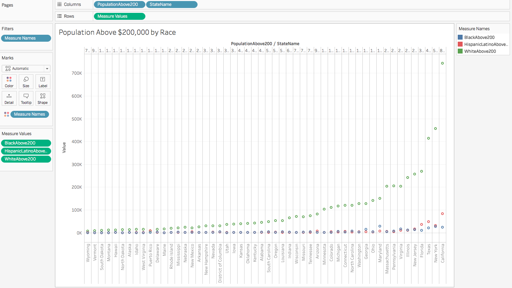

<!-- Cover -->
<center></center>

```{r setup, include=FALSE}
knitr::opts_chunk$set(echo = TRUE)
```


# **Introduction**

This is our R Notebook, for the Final Project of the course CS329e Elements of Data Visualization. This notebook includes every step that we took to build our project. In this project, we are going to look at the Poverty and Race Inequalities during the last Census Data, mainly looking at Wealth, per gender, per race, and per state, as well as Health Insurance. We often talk about race inequality in the United States, but it has always been hard to properly separate facts from cliches. In this project, we wanted to take a close look into those wealth disparities, and because we understand that the country is quite vast, we broke it down to the state level, giving us more insight into those inequalities throughout the country. 

# **The Data**

The data has been collected from the Census Data, Census Health Insurance, Census Income, and Census Poverty, joining them all by state. The data had been uploaded to a private dataset [data.world](https://data.world/lordlemon/s-17-edv-final-project), and consists of 3 tables. The first table is Income above 200, which consists of 52 rows and 10 columns for 520 records. The rows describe the 52 US States, and the columns describe the State Name, the State Abbreviated Name, The number of white People earning above 200000$ per year, the number of black People earning above 200000$ per year, and the number of hispanic People earning above 200000$ per year. 
The second table represents the Poverty of people in the United States per race and per state, with 52 rows and 5 columns for 260 records. The rows describe the 52 US States, and the columns describe the State Abbreviated Name, the State Name, the number of people below the poverty level, the white population, the black population, the hispanic population, the number of white people below the poverty level, the number of black people below the poverty level, and the number of hispanic people below the poverty level. 
Finally, the last graph represent the number of people without health insurance per gender and per state, with 52 rows and 4 columns, for 208 records. The rows still describe the 52 States, and columns describe the State Abbreviation, the State Name, the Male Population without Health Insurance, and the Female Population without Health Insurance.

# **R Configuration**

Below is the sessionInfo():

```{r sessionInfo}
#Load data and required packages
sessionInfo(package=NULL)
```

```{r, echo=FALSE}
source("../01 Data/head.R")
```

**In order to start, we must install the following packages:**
ggplot2, dplyr, tidyr, shiny, shinydashboard, data.world, readr, DT, leaflet, plotly, lubridate, reshape2, geojson, geojsonio

# **Subset and Summary**

## *Head*

```{r}
head(IncomeAbove200k)
head(PovertyUSAStates)
head(USAHealthInsurance)
```

## *Summary*

```{r}
summary(IncomeAbove200k)
summary(PovertyUSAStates)
summary(USAHealthInsurance)
```

## *Subset*

```{r}
subset(IncomeAbove200k)
subset(PovertyUSAStates)
subset(USAHealthInsurance)
```

#**Extract-Translate-Load (ETL)**

We have 3 similar ETL, one for each dataset, we are going to reproduce one here to allow you to do it on you own at your convenience.

```{r ETL, eval=FALSE}
require(readr)
#require(plyr)

## Set the Working Directory to the 02 Shiny
file_path = "../01 Data/PreETL_IncomeAbove200.csv"
df <- readr::read_csv(file_path)

## Columns with numerical values
measures <- c("WhiteAbove200","BlackAbove200","HispanicLatinoAbove200")

## Categorical Columns
dimensions <- setdiff(names(df), measures)

## Get rid of special characters in each column.
for(n in names(df)) {
  df[n] <- data.frame(lapply(df[n], gsub, pattern="[^ -~]",replacement= ""))
}

## Make state abbreviations all upper case.
df["StateABV"] <- data.frame(lapply(df["StateABV"], toupper))

## create a function that replaces NA with empty strings
na2emptyString <- function (x) {
  x[is.na(x)] <- ""
  return(x)
}

## Replace special characters using regular expressions
if( length(dimensions) > 0) {
  for(d in dimensions) {
    ## Change NA to the empty string.
    df[d] <- data.frame(lapply(df[d], na2emptyString))
    ## Get rid of " and ' in dimensions (quotation marks).
    df[d] <- data.frame(lapply(df[d], gsub, pattern="[\"']",replacement= ""))
    ## Change & to " and " in dimensions.
    df[d] <- data.frame(lapply(df[d], gsub, pattern="&",replacement= " and "))
    ## Change : to ; in dimensions.
    df[d] <- data.frame(lapply(df[d], gsub, pattern=":",replacement= ";"))
  }
}

## create a function replacing NA to zero
na2zero <- function (x) {
  x[is.na(x)] <- 0
  return(x)
}
## Get rid of all characters in measures except for numbers, the - sign, and period. Change NA to 0.
if( length(measures) > 1) {
  for(m in measures) {
    print(m)
    df[m] <- data.frame(lapply(df[m], gsub, pattern="[^--.0-9]",replacement= ""))
    df[m] <- data.frame(lapply(df[m], na2zero))
    df[m] <- data.frame(lapply(df[m], function(x) as.numeric(as.character(x)))) # This is needed to turn measures back to numeric because gsub turns them into strings.
  }
}

write.csv(df, gsub("Pre_", "", file_path), row.names=FALSE, na = "")
```

# **Data Visualization #1: Tableau - United States Map colored by Poverty **

## *Description*

In this first graph, we want to have a visual look of poverty in the United States per state. The map therefore represents the 52 US States, the color gradient spanning from Blue to Yellow, representing the percentage of people below the poverty level. The ratio more specifically represents the ratio of population in poverty divided by the state population.

## *Graph*

<center></center>

## *Interpretation*

We can see that the northern states have relatively less poor people as a percentage of the population compared to the southern states which have relatively more. Few exceptions such as Michigan or Oregon in the North, but the trend stays quite valid for most states.

# **Data Visualization #2: Tableau - Poverty per Race**

## *Description*

Now that we have seen how Poverty looked like per state, we want to take a deeper look into the states for a comparison between races. For that, we built a Barchart of Poverty broken down by state and by race. The blue bars represent the black people, the red bars represent the hispanic people, and the green bars represent the white people living in poverty.

## *Graph*

<center></center>

## *Interpretation*

It is quite apparent that consistently throughout the states, while people represent a lower percentage of the population living in poverty, whereas black and hispanic people have relatively the same high percentage of people living in poverty. When taking the average of 22 percent, we can observe that white people are consistently and significantly below that average, whereas black and hispanic are mostly above. There are however a few states which were able to decrease those inequalities, such as Alaska and Hawaii, and in a lesser measure the District of Columbia for Hispanic people.

# **Data Visualization #3: Tableau - Poverty versus Health Insurance by State and Gender**

## *Description*

The third visualization is a plot that displays not having health insurance where one blue is male and red is female, as well as a linear regression per gender. That visualization implicitly measures the quality of Social Services to provide basic healthcare to poor people.

## *Graph*

<center></center>

## *Interpretation*

Because of the size of some of the States, it makes sense to have California and Texas having a relatively high number of people below the poverty level, but compared to the number of people without health insurance, we can see that California follow the national average, whereas Texas or Florida have a higher rate of people without health insurance. On the other hand, states such as New York, Ohio, Michigan, Puerto Rico or Massachusetts have a really low rate of people without health insurance. At the same time, the absolute value of people still matter as it is understandable to have more trouble enforcing basic healthcare to poor people in bigger states.

# **Data Visualization #4: Tableau - Wealthy People by Race and by State**

## *Description*

Finally, we want to contrast the picture that we have painted so far with the number of wealthy people, broken down by race. The last visualization is a scatter plot of the number of extremely rich people, which we categorized by the number of people who have a revenue that is above 200000$. We have black people in blue, hispanic people in red and white people in green.

## *Graph*

<center></center>

## *Interpretation*

This graph confirms the previous ones, showing a large disparity between white people and black or hispanic people. We see that the more rich people their are, the more the ratio of white people command the group. That contrast is more apparent in some states, especially in California, New York and Texas, but also quite apparent in Florida, New Jersey, Illinois, Virginia, Pennsylvania and Massachussetts.

# **Shiny App**

With this app hosted with Shinyapps, the barcharts for each visualization can be viewed through this link: https://leo16.shinyapps.io/finalproject2/

# **Conclusion**

In conclusion, we were able to get a better look into Poverty and Wealth Inequality in the United States of America. We would hope that in a country as developped as ours, that those social disparities would be less obvious. Unfortunately, those three visualizations show that poor people still have the same low access to Education and Health Insurance. On top of that, in case of female people, even having access to Education is not a predictor of wealth.
